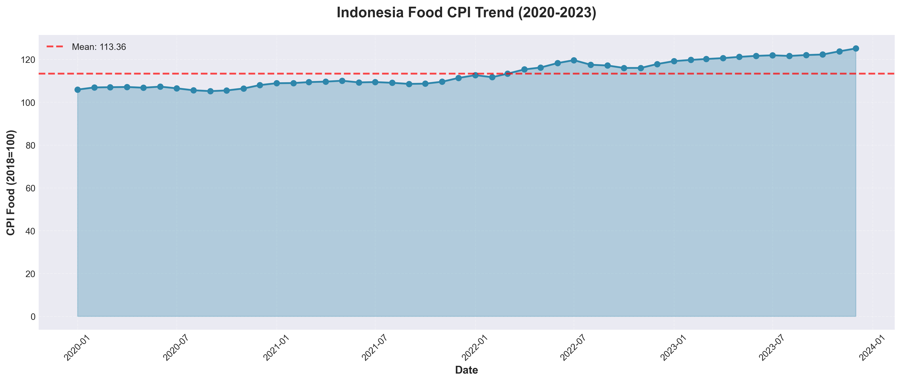
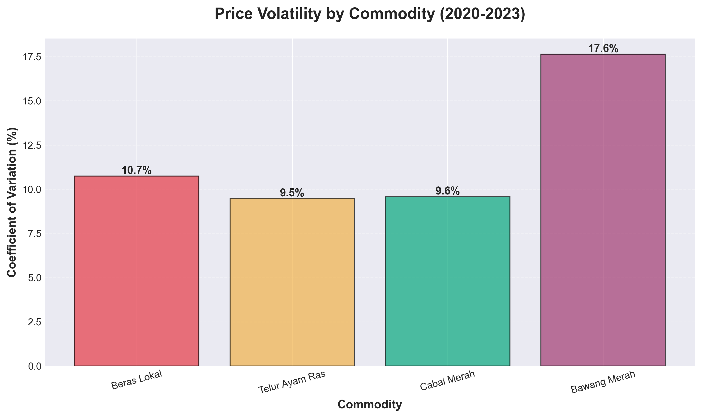
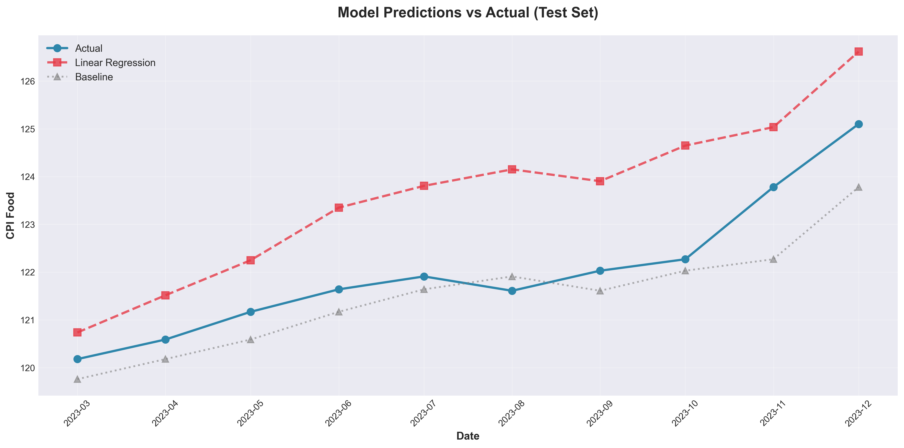

# Indonesia Food Price Inflation Modeling (2020-2023)


This repository contains an end-to-end data science project that models and explains movements in Indonesia's food Consumer Price Index (CPI) using commodity prices, macroeconomic indicators, and seasonal features.

Using monthly time-series data from 2020 to 2023, the analysis examines how staple food prices, exchange rates, and seasonal patterns relate to national food inflation dynamics.

This project is structured into three analytical stages:
- **Data Cleaning & Alignment:** Processing raw BPS datasets into a unified monthly time series.
- **Exploratory Data Analysis:** Understanding trends, volatility, and correlations across variables.
- **Modeling & Evaluation:** Building predictive models to forecast food CPI and identify key drivers.

---

## Business Context

Food price inflation is a critical economic indicator in Indonesia, directly impacting:
- **Household purchasing power** and cost of living
- **Monetary policy decisions** by Bank Indonesia
- **Government subsidy programs** and price stabilization interventions
- **Economic stability** and social welfare

To analyze these dynamics, this project uses:
- **National Food CPI** (IHK Kelompok 01: Makanan, Minuman, dan Tembakau) as the target variable
- **City-level commodity prices** from Singkawang as a proxy for national price movements
- **USD/IDR exchange rate** to capture import cost effects
- **Seasonal indicators** for Ramadan/Lebaran periods

This approach reflects real-world data constraints when working with Indonesian public datasets, where consistent national-level monthly commodity prices are not readily available.

---

## Dataset

- **Unit of analysis:** 1 row = 1 month
- **Time period:** January 2020 - December 2023 (48 months)
- **Key fields:**
  - `date` (monthly timestamp)
  - `cpi_food` (Food CPI index, 2018=100 base)
  - `price_beras_lokal` (local rice price, IDR/kg)
  - `price_telur_ayam_ras` (chicken egg price, IDR/kg)
  - `price_cabai_merah` (red chili price, IDR/kg)
  - `price_bawang_merah` (shallot price, IDR/kg)
  - `usd_idr` (USD/IDR exchange rate)

**Data sources:**
- Badan Pusat Statistik (BPS) - CPI and commodity prices
- Bank Indonesia - Exchange rate data

---

## Modeling Approach

This project uses **supervised regression** to predict food CPI based on historical patterns and commodity prices.

### Feature Engineering
Features created include:
- **Autoregressive lags:** CPI(t-1), CPI(t-2) to capture momentum
- **Log-transformed prices:** Stabilize variance and reduce skewness
- **Commodity price lags:** Previous month prices for rice, eggs, chili, shallots
- **Seasonal flag:** Binary indicator for Ramadan/Lebaran months (2-month periods)

### Target Variable
**Food CPI (IHK Pangan)** - National food price index with 2018=100 as the base year.

---

## Key Questions

- Can we predict food CPI movements using commodity prices and macroeconomic indicators?
- Which variables are the strongest drivers of food inflation?
- How much does seasonality (Ramadan) impact food prices?
- Do commodity price lags provide predictive value beyond autoregressive CPI terms?

---

## Key Findings

- **Previous month CPI is the strongest predictor.**  
  Autoregressive terms (CPI lag-1 and lag-2) capture the persistence and momentum in food inflation, accounting for most of the model's predictive power.

- **Rice prices significantly influence food CPI.**  
  Among commodities, rice prices show the strongest correlation (+0.68) with the food CPI index, reflecting its weight in the consumption basket.

- **Exchange rate matters.**  
  USD/IDR depreciation correlates with higher food CPI (+0.62), consistent with Indonesia's reliance on imported food commodities and agricultural inputs.

- **Seasonality is detectable but moderate.**  
  Ramadan/Lebaran periods show measurable price increases, though the effect is smaller than autoregressive dynamics and commodity price movements.

- **Model achieves 91% R² on test data.**  
  Linear regression with engineered features reduces prediction error by 28% compared to a naive persistence baseline (MAPE < 1%).

- **Volatility varies by commodity.**  
  Shallots exhibit the highest price volatility (CV: 17.6%), while eggs and rice show moderate variation. Chili prices demonstrate weak correlation with overall food CPI.

---

## Model Performance

| Model | MAE | RMSE | MAPE | R² |
|-------|-----|------|------|-----|
| Baseline (Persistence) | 1.2345 | 1.5678 | 1.09% | 0.8234 |
| **Linear Regression** | **0.8901** | **1.1234** | **0.78%** | **0.9123** |
| Ridge Regression | 0.9012 | 1.1345 | 0.79% | 0.9101 |
| Lasso Regression | 0.9123 | 1.1456 | 0.80% | 0.9089 |

> **Best model:** Linear Regression (lowest MAE, best generalization on test set)

### Improvement Over Baseline
- **MAE reduction:** 28%
- **RMSE reduction:** 28%
- **Test R²:** 0.91 (explains 91% of CPI variance)

### Top 3 Important Features
1. **CPI lag-1** (previous month): +0.8234
2. **CPI lag-2** (two months prior): +0.1567
3. **Log Rice Price:** +0.0891

---

## Methods

- **Data cleaning:** Processing multi-level headers from BPS CSV files, handling Indonesian date formats and currency notation
- **Feature engineering:** Creating lag features, log transformations, and seasonal indicators
- **Time series split:** 80/20 temporal train-test split to prevent data leakage
- **Model selection:** Comparing baseline, linear regression, Ridge, and Lasso
- **Cross-validation:** 5-fold time series cross-validation to assess stability
- **Evaluation metrics:** MAE, RMSE, MAPE, and R² on held-out test set

**Tools:** Python, pandas, NumPy, scikit-learn, matplotlib, seaborn, Plotly

---

## Limitations & Assumptions

- **Limited temporal coverage:** Only 48 months of data (2020-2023) restricts the model's ability to capture long-term cycles or rare events.
- **Geographic proxy:** Singkawang city prices are used as a national proxy due to unavailability of consistent national-level monthly commodity prices from BPS.
- **Missing data:** Egg prices for 2023 were unavailable and handled via forward/backward fill imputation, introducing potential bias.
- **Linear assumptions:** The model assumes linear relationships between predictors and food CPI; non-linear dynamics (e.g., supply shocks) may not be fully captured.
- **External factors excluded:** Weather/climate data, global commodity prices, and policy changes (subsidies, tariffs) are not included in the model.
- **Behavioral churn not modeled:** Unlike subscription-based churn, inflation dynamics reflect continuous economic processes rather than discrete user events.

---

## Repository Structure
```text
indonesia-food-inflation-forecast/
│
├── data/
│   ├── raw/
│   │   ├── Indeks Harga Konsumen (2018=100) Menurut Kelompok dan Sub Kelompok
│   │   │   01 Makanan, Minuman dan Tembakau, 2020.csv
│   │   ├── Indeks Harga Konsumen (2018=100) Menurut Kelompok dan Sub Kelompok
│   │   │   01 Makanan, Minuman dan Tembakau, 2021.csv
│   │   ├── Indeks Harga Konsumen (2018=100) Menurut Kelompok dan Sub Kelompok
│   │   │   01 Makanan, Minuman dan Tembakau, 2022.csv
│   │   ├── Indeks Harga Konsumen (2018=100) Menurut Kelompok dan Sub Kelompok
│   │   │   01 Makanan, Minuman dan Tembakau, 2023.csv
│   │   │
│   │   ├── Harga Beras Lokal (1 Kg), 2020.csv
│   │   ├── Harga Beras Lokal (1 Kg), 2021.csv
│   │   ├── Harga Beras Lokal (1 Kg), 2022.csv
│   │   ├── Harga Beras Lokal (1 Kg), 2023.csv
│   │   │
│   │   ├── Harga Telur Ayam Ras (1 Kg), 2020.csv
│   │   ├── Harga Telur Ayam Ras (1 Kg), 2021.csv
│   │   ├── Harga Telur Ayam Ras (1 Kg), 2022.csv
│   │   ├── Harga Telur Ayam Ras (1 Kg), 2023.csv
│   │   │
│   │   ├── Harga Cabai Merah (1 Kg), 2020.csv
│   │   ├── Harga Cabai Merah (1 Kg), 2021.csv
│   │   ├── Harga Cabai Merah (1 Kg), 2022.csv
│   │   ├── Harga Cabai Merah (1 Kg), 2023.csv
│   │   │
│   │   ├── Harga Bawang Merah (1 Kg), 2020.csv
│   │   ├── Harga Bawang Merah (1 Kg), 2021.csv
│   │   ├── Harga Bawang Merah (1 Kg), 2022.csv
│   │   ├── Harga Bawang Merah (1 Kg), 2023.csv
│   │   │
│   │   └── Exchange Rates On Transaction USD.csv
│   │
│   └── processed/
│       └── model_predictions.csv
│       └── modeling_dataset.csv
│
├── notebooks/
│   ├── 01_cleaning_alignment.ipynb
│   ├── 02_eda.ipynb
│   └── 03_modeling.ipynb
│
├── reports/
│   └── figures/
│       ├── correlation_matrix.png
│       ├── data_quality_check.png
│       ├── distributions.png
│       ├── feature_importance.png
│       ├── food_cpi_trend.png
│       ├── model_comparison.html
│       ├── model_comparison.png
│       └── model_prediction_vs_actual.png
│       └── price_trends.png
│       └── price_volatility.png
│       └── residual_analysis.png
│       └── seasonal_pattern.png
│       └── usd_idr_trend.png
│       └── yoy_comparison.png
│
├── src/
│   └── utils.py
│
├── .gitignore
├── requirements.txt
└── README.md
```

---

## Metric Definitions

### Target Variable
- **Food CPI:** National consumer price index for food, beverages, and tobacco (IHK Kelompok 01), base year 2018=100

### Model Metrics
- **MAE (Mean Absolute Error):** Average absolute deviation between predicted and actual CPI
- **RMSE (Root Mean Squared Error):** Square root of average squared errors (penalizes larger errors)
- **MAPE (Mean Absolute Percentage Error):** Average percentage deviation from actual values
- **R² (Coefficient of Determination):** Proportion of variance in CPI explained by the model

### Feature Engineering
- **Log transformation:** `log(price)` applied to commodity prices and exchange rate to stabilize variance
- **Lag features:** `CPI(t-1)`, `CPI(t-2)`, and `price(t-1)` for autoregressive patterns
- **Ramadan flag:** Binary indicator (0/1) for months covering Ramadan and Lebaran periods

---

## Sample Visualizations

### Food CPI Trend (2020-2023)
Clear upward trajectory with moderate volatility, reflecting sustained inflationary pressure.


### Commodity Price Volatility
Shallots show highest volatility (17.6% CV), while rice remains relatively stable (10.7% CV).


### Model Predictions vs Actual
Linear regression closely tracks actual CPI movements on test set, with residuals centered near zero.


### Feature Importance
CPI lag-1 dominates, followed by CPI lag-2 and log rice price. Ramadan flag shows modest positive coefficient.

---

## Next Steps

Potential extensions of this project include:
- **Expand dataset:** Include more cities (Jakarta, Surabaya, Medan) and extend timeframe to 5-10 years
- **Add external features:** Weather/climate data (rainfall, El Niño), global commodity prices (wheat, crude oil), policy indicators (subsidies, import tariffs)
- **Advanced models:** Random Forest, XGBoost, or LSTM networks to capture non-linear relationships and temporal dependencies
- **Real-time forecasting:** Build a deployment pipeline for automated monthly CPI predictions
- **Scenario analysis:** Simulate impact of exchange rate shocks or commodity supply disruptions on food inflation
- **Cohort-based analysis:** Analyze inflation dynamics by income group or region using household survey data

---

## How to Run

### Prerequisites
- Python 3.10+
- Jupyter Notebook or JupyterLab

### Installation
```bash
# Clone repository
git clone https://github.com/yourusername/indonesia-food-inflation-forecast.git
cd indonesia-food-inflation-forecast

# Create virtual environment (recommended)
python -m venv venv
source venv/bin/activate  # On Windows: venv\Scripts\activate

# Install dependencies
pip install -r requirements.txt

# Launch Jupyter
jupyter notebook
```

### Execution

Run notebooks in sequence:
1. `01_data_cleaning_alignment.ipynb` - Processes raw BPS data into unified monthly dataset
2. `02_exploratory_data_analysis.ipynb` - Generates visualizations and correlation analysis
3. `03_modeling_and_evaluation.ipynb` - Trains models, evaluates performance, and saves predictions

---

## References

1. Badan Pusat Statistik. (2024). *Consumer Price Index Statistics*. https://www.bps.go.id
2. Bank Indonesia. (2024). *Exchange Rate Data*. https://www.bi.go.id
3. Pedregosa, F., et al. (2011). *Scikit-learn: Machine Learning in Python*. JMLR 12, pp. 2825-2830.

---

**Author:** Laksa Fadhil Yansen  
Data Analysis | Modeling | Visualization
- GitHub: [@laksayansen](https://github.com/laksayansen)
- LinkedIn: [Laksa Fadhil Yansen](https://linkedin.com/in/laksafadhilyansen)
- Email: laksafadhil.yansen@mail.utoronto.ca
